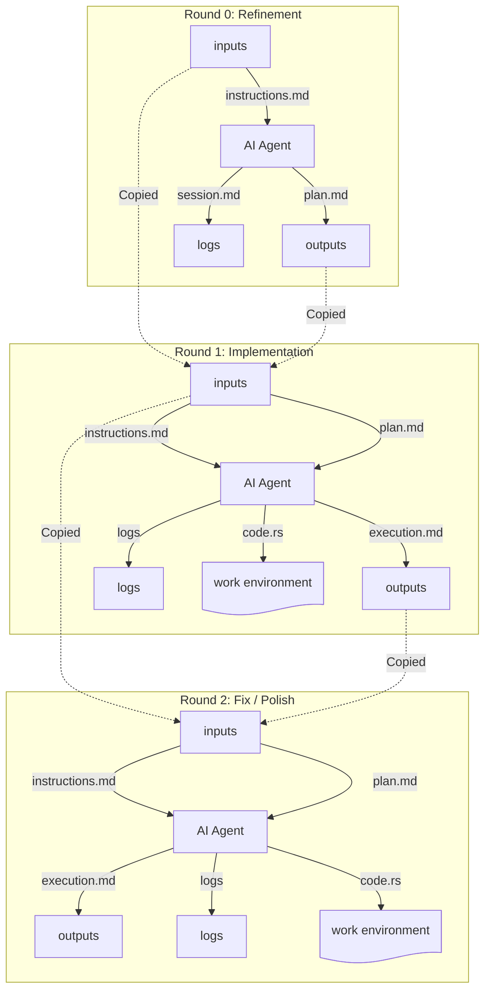

# Adjent

Adjent is a task manager designed to orchestrate complex software engineering tasks with AI agents. It provides a structured environment for agents to interact with project artifacts (inputs, outputs, and logs) in a scoped and reproducible manner.

## Core Concepts

- **Projects**: The top-level container for a specific codebase or goal.
- **Tasks**: Discrete units of work within a project (e.g., "implement-mcp-server").
- **Rounds**: Iterative attempts at a task. Each round has its own set of artifacts.
- **Artifacts**: Files categorized into `inputs` (read-only for agents), `outputs` (agent results), and `logs` (execution trails).
- **Actions**: Specific requests sent to an agent to perform work on a round.

### Workflow & Artifact Flow

The following diagram illustrates a typical iterative session where an agent moves from refinement to development across multiple rounds. Note how `outputs` from one round become `inputs` for the next.



## Getting Started

### Installation

```bash
cargo build --release
```

### Starting the Server

The Adjent server provides both a REST API for management and an MCP endpoint for agents.

```bash
# Start on default port 8080
./target/release/adjent server start
```

### Starting the Manager

The manager is a long-running process that polls the server for pending actions in a project and spawns an agent to process them.

```bash
# Start the manager for a project
./target/release/adjent manage --project your-project-id --agent "your-agent-command"
```

The `agent-command` is the command used to start your AI agent (e.g., `claude` or `gemini-cli`). The manager automatically spawns agents to work on tasks.

## Agent Configuration

Adjent exposes an MCP server via SSE (Server-Sent Events) at `/mcp`. Agents must provide scoping headers to identify which project and action they are working on.

When the manager spawns an agent, it sets the `ADJENT_PROJECT_ID` and `ADJENT_ACTION_ID` environment variables. Agent configurations should use these variables to set the required headers.

### 1. Claude Code

To use Adjent with Claude Code, add it as an MCP server in your configuration:

```json
{
  "mcpServers": {
    "adjent": {
      "type": "sse",
      "url": "http://localhost:8080/mcp",
      "headers": {
        "X-Adjent-ProjectId": "${ADJENT_PROJECT_ID}",
        "X-Adjent-ActionId": "${ADJENT_ACTION_ID}"
      }
    }
  }
}
```

### 2. Gemini CLI

For `gemini-cli`, you can configure the MCP server in your `settings.json` or equivalent config file:

```json
{
  "mcpServers": {
    "adjent": {
      "url": "http://localhost:8080/mcp",
      "env": {
        "ADJENT_PROJECT_ID": "${ADJENT_PROJECT_ID}",
        "ADJENT_ACTION_ID": "${ADJENT_ACTION_ID}"
      },
      "headers": {
        "X-Adjent-ProjectId": "${ADJENT_PROJECT_ID}",
        "X-Adjent-ActionId": "${ADJENT_ACTION_ID}"
      }
    }
  }
}
```

## Scoping Architecture

Adjent strictly scopes agent actions. An agent connected with a specific `X-Adjent-ActionId` can only see and modify artifacts associated with the task and round linked to that action. This ensures that agents don't accidentally leak context between different tasks or projects.

