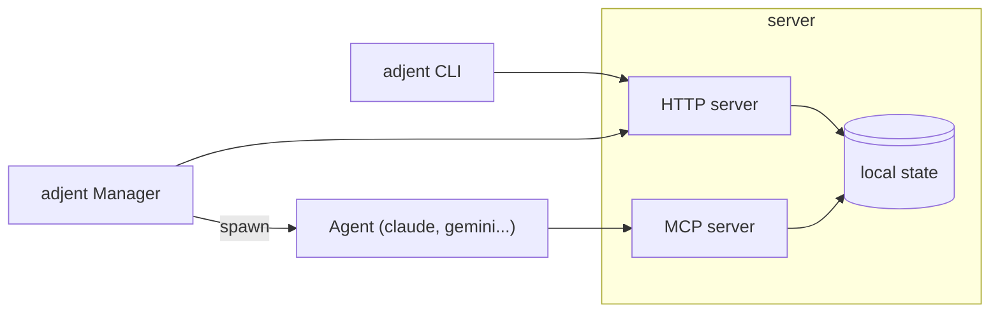

# Adjent

Adjent is a orchestrator for agents with human in the loop. It allows to orchestrate many agents and tasks in parallel while keeping the control of the agents's outputs.

It is composed of several parts:

- A web-server: This is where all core features are implemented
- A CLI tool: Most CLI commands use the web-server to do actions
- An MCP server: Coding agents use this MCP server - with HTTP transport - to interact with the web-server.
- An agent manager: The manager waits for work to be done on tasks and rounds. For each new action on a round, it spawn a coding agent. 

Detailed information on the CLI tool are in [cli](cli.md)

The whole project is implemented in rust, as a single executable file that acts as one of the components (web-server, cli, MCP server, agent manager) depending on how it is being called. 

When started as a server, adjent acts both as an HTTP server and an MCP server.

Adjent works as a local-tool first, where all the instructions to the agents are available as local mardown files. 

