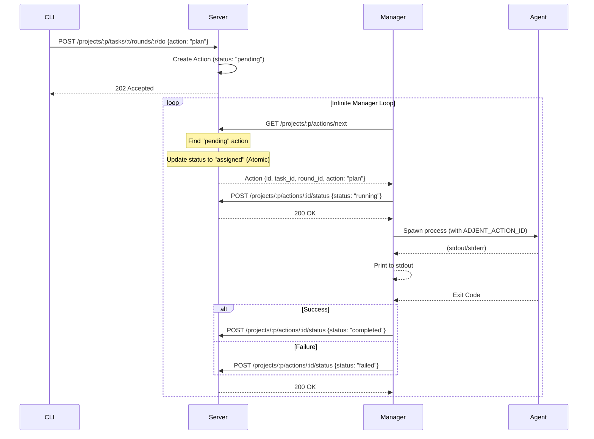

# Adjent Manager

The manager is responsible for spawning an agent each time a new action is triggered.
The manager is started on a specific project. It then waits for actions via the HTTP server.

Each time a new action is received, the manager spawns the agent (for example claude code or gemini cli). The agent is provided as an argument of the `adjent manage` command. Once an agent is spawned, the manager waits until its completion. Then it waits again for another action to be available.

## Architecture



## Agent Lifecycle

The manager must spawn the agent in the same environment that it is executed on. It forwards all environment variables and injects the following specific ones:

- `ADJENT_PROJECT_ID`: The current project ID.
- `ADJENT_TASK_ID`: The current task ID.
- `ADJENT_ROUND_ID`: The current round ID.
- `ADJENT_ACTION_ID`: The ID of the action being processed.
- `ADJENT_ACTION`: The name of the action (e.g., `plan`, `implement`).

The spawned agent uses these variables to interact with the project state, typically via the MCP server resources.

## Usage

```bash
adjent manage --project my-project --agent "gemini-cli"
```
